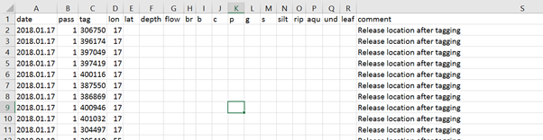
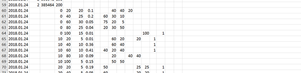
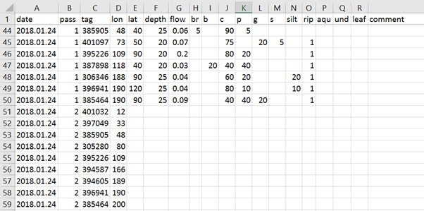

# hughsProjects
This file is defined as the `README.md` file and on a `github` account as long as the file is called exactly as above it will automatically be added as the rendered `html` file when users open the `github` repository like as above.

## Week one

Download the file as a zip as below:

Or fork it from your github account if you have already got one:

YOu need the following packages:

# Key questions

The first week will take the basic dataset above to address the following key questions:

##### Do fish prefer to use areas with high proportions of certain substrates? 

- We may expect fish prefer areas of larger substrates (boulder, cobble), and less of small substrates (silt, sand)?

##### Do fish prefer some of the other habitat variables (rip, aqu, und, leaf)?

- We may expect fish like these habitat features as they provide cover from predators etc

##### Do fish prefer areas of fast/slow water, and likewise deep/shallow water?

- Also, depth may be related to velocity, which may be related to dominant substrate type (higher velocity = larger substrate particles)
- Or, do fish just use the available habitat in the proportions that it is available?

# Data

#### The data is a little more complex

The first few rows are where fish were released
(batch-released at a few locations)

#### And a bit more

Then, when fish are 
located habitat variables are recorded (initially only for pass 1, but
later for both passes 1 and 2)

